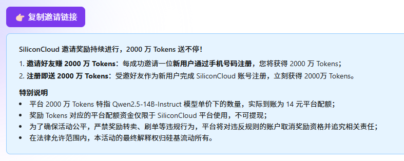
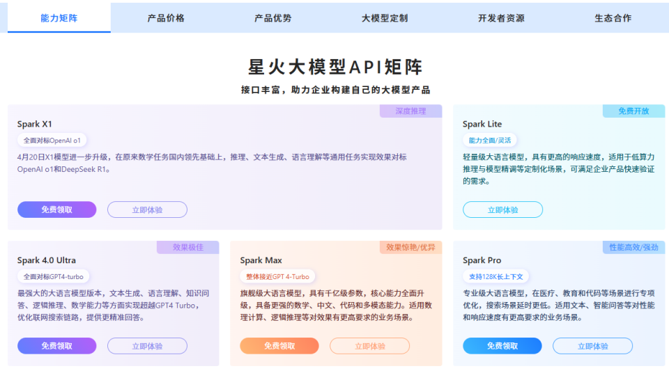
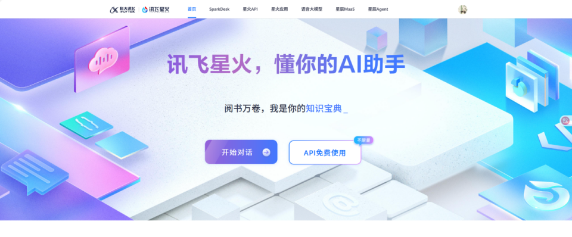
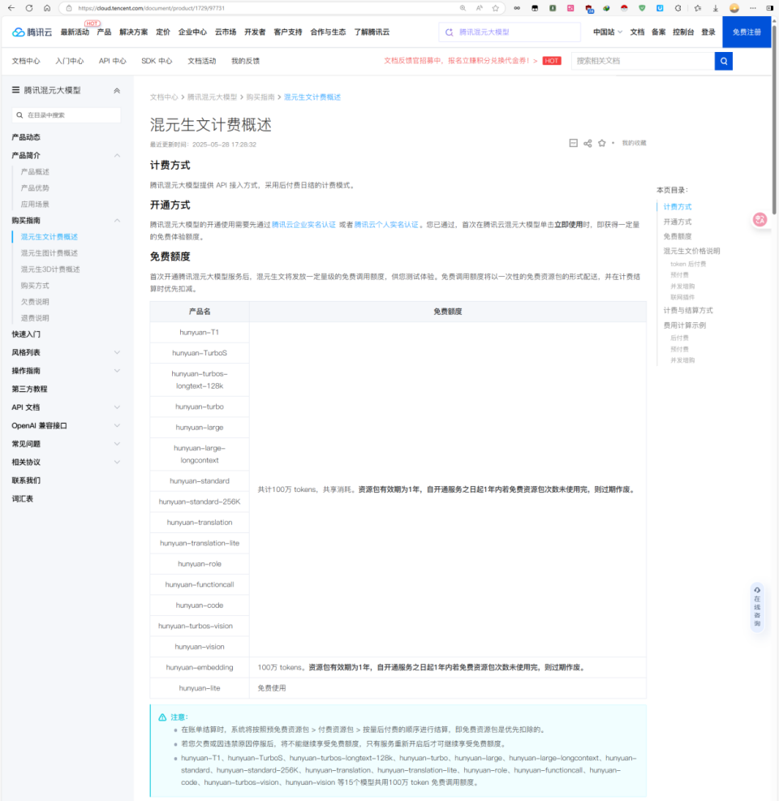
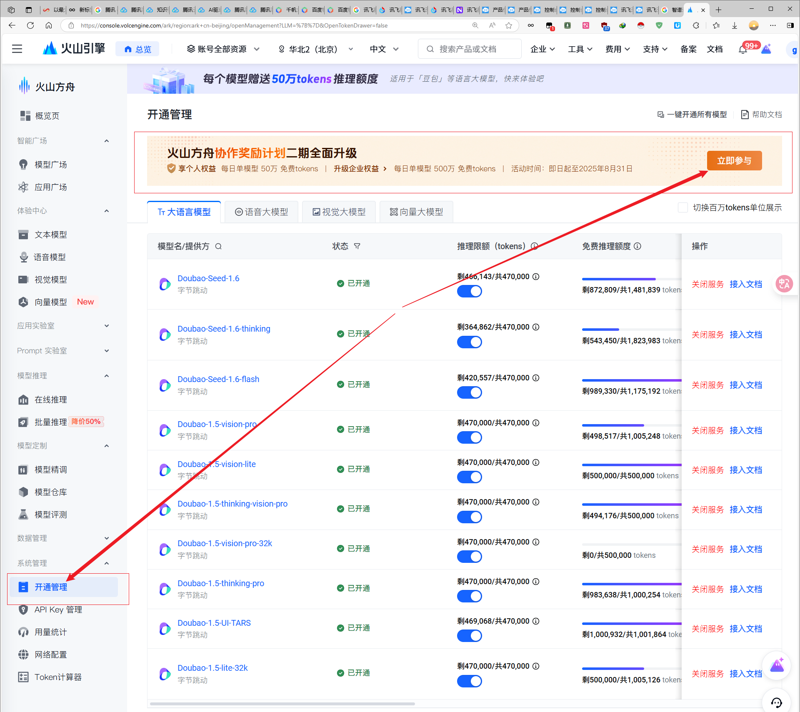
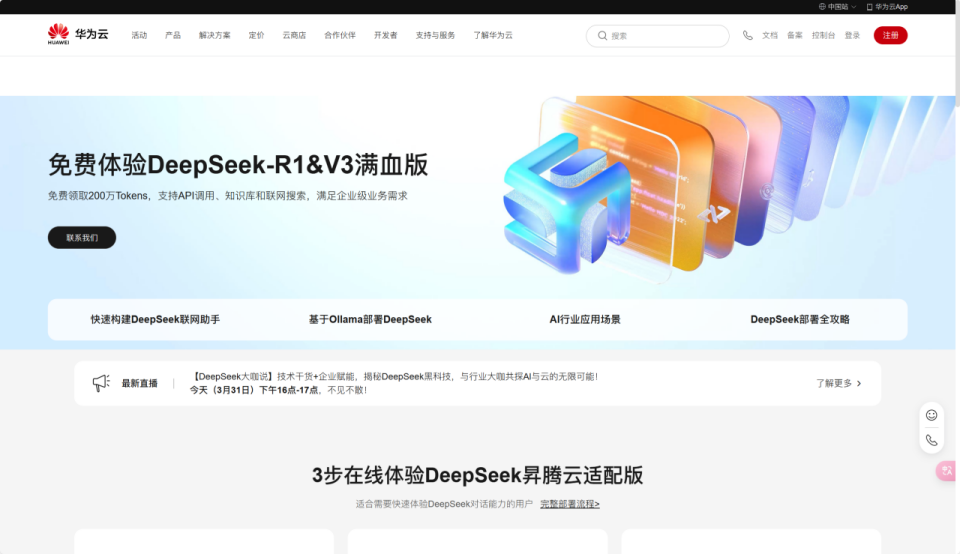

# FreeLLM-API-KeyHub 🆓
本项目旨在整理可免费调用大模型API的服务商资源，持续更新中...
实时追踪大模型平台免费资源 | [English](README_EN.md) | [更新日志](#更新日志) | [提交情报](CONTRIBUTING.md)

实时追踪国内大模型厂商的**免费API资源**与**限时模型调用**情报
⚠️ 本仓库不提供任何API Key，仅汇总官方公开的免费资源信息 ⚠️

> **建议查看在线表格：https://kdocs.cn/l/cezjXYdUR1dl（第一时间更新）**

各平台文件下有详细信息，帮你快速了解以及快速接入One-API或New-API，提供模型ID和示例重定向

**✨ 有其他可以白嫖的资源欢迎提交issues或PR！✨**

| 平台 | 地址 | 免费token数 | 有效期 | 活动 | 备注说明 | 图1 | 图2 |
| :--- | :--- | :--- | :--- | :--- | :--- | :--- | :--- |
| 天翼云 | [www.ctyun.cn](https://www.ctyun.cn/act/xirang/deepseek) | 2500万 | 两周 | 新用户 | 量大时间短 比之前更新了很多模型 主流开源都有 |  |  |
| 移动云 | [ecloud.10086.cn](https://ecloud.10086.cn/portal/act/deepseek) | 2500万 | 30天 | 新老用户 | 新版界面需要创建项目空间后弹出面板 更新了规范些的接口地址 |  | |
| 硅基流动 | [cloud.siliconflow.cn](https://cloud.siliconflow.cn/i/NpVqAT7X) | 2000万（14元） | 无 | **学生认证50元巨款** 邀请注册送14￥白嫖 可用前面我的链接注册（感谢） | 白嫖开始的地方 速度现在还好，之前慢 配额一直有效  |  | 可以使用前面我的要求链接哦！！！谢谢啦~ |
| 欧派算力云 | [ppinfra.com](https://ppinfra.com/user/register?invited_by=HPU4F4) | 新用户注册5￥ 邀请注册得15￥ | 6月 | 邀请 1 位好友注册并完成实名认证，邀请人可得 30元无门槛代金券，被邀请人可得 15元无门槛代金券 | 可以使用前面我的要求链接 感谢 |  | |
| 智普AI开放平台 | https://www.bigmodel.cn/invite?icode=x8lF7NKzY%2B5LTsN4htQ3QGczbXFgPRGIalpycrEwJ28%3D | 2000万                          | 3月              | 新用户注册得 2000万 Tokens，新模型免费玩到爽！               | 邀请一名新用户完成实名注册，双方均可获得智谱高性价比GLM-4.5-Air 模型2000万Tokens 每月最多邀请10名新用户，最多可获得2亿Tokens资源包 |  |  |
| 讯飞星火 | [xinghuo.xfyun.cn](https://xinghuo.xfyun.cn/sparkapi) | 注册送20元礼品卡 | 无 | 我账户注册后又20元礼品卡无过期时间 页面中还有其他活动，请注意看 | 页面活动挺多的，比如“图1†如“图2”直接就是说API免费使用不限量：图2地址 |  |  |
| 阿里百炼 | [bailian.console.aliyun.com](https://bailian.console.aliyun.com/) | 100万（每个模型） | 不同模型30~180天 | 新用户注册每个模型赠送100万tokens | 速度快、实力强、模型及种类多 我已欠费 |  | |
| 腾讯混元 | [cloud.tencent.com](https://cloud.tencent.com/document/product/1729/97731) | 100万（共享消耗） | 1年 | 自家混元模型共享消耗1年一百万 体验说明地址 其它模型活动未查看，有请反馈 | Deepseek R1/V3免费调用至北京时间2025年2月25日23:59:59 |  | |
| 火山引擎 | [www.volcengine.com](https://www.volcengine.com/experience/ark?utm_term=202502dsinvite&ac=DSASUQY5&rc=SYKEHGED) | 50万（每个模型） | 无 | ~~拉人注册送30￥大模代金券（无需实名） 送被邀请15￥（自己注册无） 邀请用户付费再送100￥ 约可抵扣750万R1模型tokens 速度比较快后悔没有多撸点，几百狠狠用~~ | 如“图2”还可以参加“协作”活动 出卖自己数据，每天每个模型免费50万额度 |  |  |
| 百度千帆 | [cloud.baidu.com](https://cloud.baidu.com/product-s/qianfan_home) | 注册送20元 | 1月 | 注册后自动送 转换为tokens最多能用1000000+tokens | 送的20我是一点都没用啊 |  | |
| 商汤大装置 | [www.sensecore.cn](https://www.sensecore.cn) | 1000万 | 3月 | 活动说明地址：商汤新闻中心 我的账户注册就送了6个月80代金券 | 自家模型速率rpm限制还好、Deepseek、qwen3……低rpm ~~Deepseek R1/V3限时免费至5月9日~~ |  | |
| ~~华为云~~ | ~~[activity.huaweicloud.com](https://activity.huaweicloud.com/maas-ds.html)~~ | ~~200万（每个模型）~~ | ~~无~~ | ~~现没明确看见，有请联系我更新 一个模型一个接口地址 已更新Deepseek V3 0324版~~ | ~~无~~ |  | |
| ~~英伟达~~ | ~~[build.nvidia.com](https://build.nvidia.com/explore/discover)~~ | ~~前一千次调用免费~~ | | ~~没怎么用，依旧有效可联系~~ | | | |

